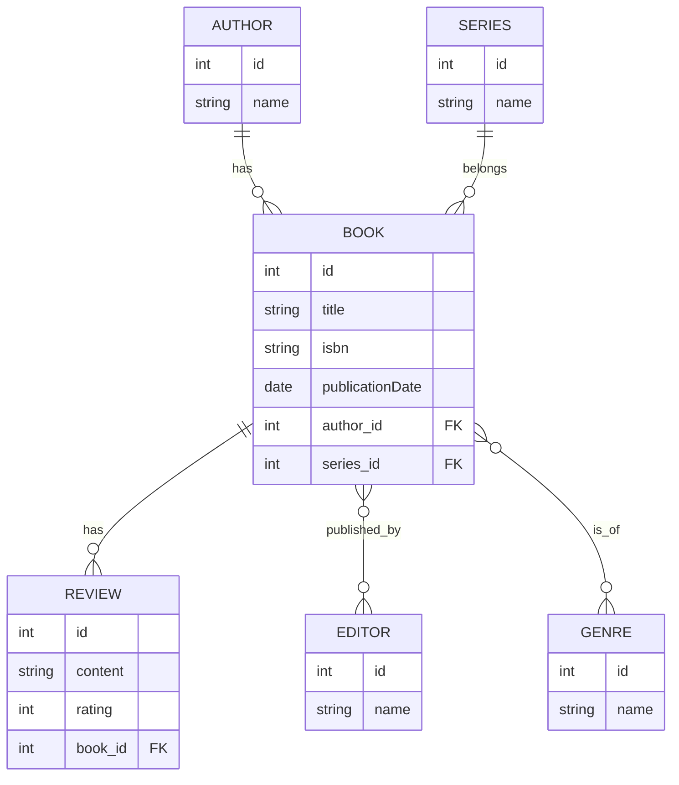

# 📚 Editorial API: Plataforma Híbrida (REST + GraphQL) 

**La Editorial API es un sistema de gestión de contenido editorial de próxima generación.** Implementada sobre Symfony y Api Platform, establece una arquitectura híbrida: utiliza la robustez de **REST** para los procesos críticos de autenticación y seguridad (JWT), y la eficiencia de **GraphQL** para todas las operaciones de datos (CRUD avanzado y lógica de negocio). Este enfoque se apoya en el patrón **Mediator (State Providers y Processors)** para asegurar un código limpio, desacoplado y listo para manejar lógica transaccional compleja, garantizando la escalabilidad y la claridad del modelo de dominio de libros, autores y reseñas.

Bienvenido al repositorio de la **Editorial API**, una plataforma robusta construida con **Symfony** y **Api Platform**. Esta API está diseñada bajo una arquitectura moderna que separa las responsabilidades de Seguridad (gestionada por REST) y la Gestión de Datos (gestionada por GraphQL), utilizando el patrón Mediator para una lógica de negocio desacoplada.

## 1\. Arquitectura de la API: Un Enfoque Híbrido 🛡️

El diseño de esta API sigue una regla estricta para garantizar claridad, eficiencia y desacoplamiento:

| Responsabilidad | Patrón de Implementación | Endpoints / Mecanismo |
| --- | --- | --- |
| **Seguridad y Autenticación** | **REST (Implementación Manual)** | `/api/register`, `/api/login_check`, `/api/token/refresh` |
| **Gestión de Datos (CRUD y Lógica)** | **GraphQL (Api Platform)** | `/api/graphql` (Queries, Mutations, Resolvers) |

### 1.1. Aclaración de Endpoints y GraphQL

Entendemos que los endpoints de datos básicos (CRUD) puedan aparecer en la documentación de Swagger (`/api/docs`), ya que Api Platform los genera por defecto cuando usamos la anotación `#[ApiResource]`.

**Sin embargo, la regla de negocio es inmutable:**

-   **Para autenticarse, usar REST.**
    
-   **Para interactuar con Libros, Autores, Géneros, etc., usar GraphQL.**
    

El único _endpoint_ de seguridad que puede aparecer en Swagger es `/api/login_check`, ya que Api Platform lo inyecta para completar la documentación de autenticación, aunque se gestione manualmente.

### 1.2. Patrón de Manejo de Lógica (Mediator)

Para implementar lógica de negocio que va más allá del CRUD básico (como búsquedas complejas o transacciones multi-entidad), utilizamos el patrón **Mediator**, implementado en Api Platform mediante:

-   **State Providers:** Se usan para las **lecturas (Queries)**. Son clases encargadas de obtener datos, inyectando lógica personalizada (como nuestra consulta `searchBooksByTitle`).
    
-   **State Processors:** Se usarán para las **escrituras (Mutations)**. Son clases que contendrán la lógica transaccional o de validación antes de persistir los datos.
    

## 2\. Modelo de Entidades y Relaciones 🌳

El proyecto modela un sistema de gestión editorial con las siguientes entidades principales y sus relaciones:

| Entidad | Relaciones Clave | Grupos de Serialización |
| --- | --- | --- |
| **Book** 📖 | ManyToOne (Author, Series), ManyToMany (Editor, Genre), OneToMany (Review) | `book:read`, `book:list`, `book:write` |
| **Author** ✍️ | OneToMany (Book) | `author:read`, `author:list`, `author:write` |
| **Series** 📚 | OneToMany (Book) | `series:read`, `series:list`, `series:write` |
| **Editor** 💼 | ManyToMany (Book) | `editor:read`, `editor:list`, `editor:write` |
| **Genre** 🏷️ | ManyToMany (Book) | `genre:read`, `genre:list`, `genre:write` |
| **Review** ⭐ | ManyToOne (Book) | `review:read`, `review:list`, `review:write` |

### Diagrama de Relaciones (Mermaid)

El siguiente diagrama refleja las relaciones definidas en Doctrine/Symfony:

## 3\. Rutas de Acceso y Documentación 🔗

Una vez que el servidor Symfony está activo, puedes acceder a la documentación interactiva a través de las siguientes URL:

| Plataforma | Propósito | URL de Acceso |
| --- | --- | --- |
| **Swagger UI** | Documentación de Endpoints REST (Seguridad y CRUD generado) | `/api/docs` |
| **GraphiQL** | Interfaz para probar Queries y Mutations de GraphQL | `/api/graphql` |
| **Entrypoint** | Lista de recursos de Api Platform | `/api` |

## 4\. Próximos Pasos en el Desarrollo 🚀

El siguiente hito será implementar la lógica de negocio avanzada:

1.  **Consulta Personalizada con Provider:** Completar la lógica de búsqueda de libros por título (`searchBooksByTitle`) utilizando el `SearchBookByTitleQueryHandler`.
    
2.  **Autorización Avanzada (Field-Level Security):** Implementar la seguridad a nivel de campo (p. ej., solo Administradores pueden ver el ISBN).
    
3.  **Transacciones (State Processors):** Crear Processors para asegurar que las Mutaciones complejas se ejecuten de forma atómica.
